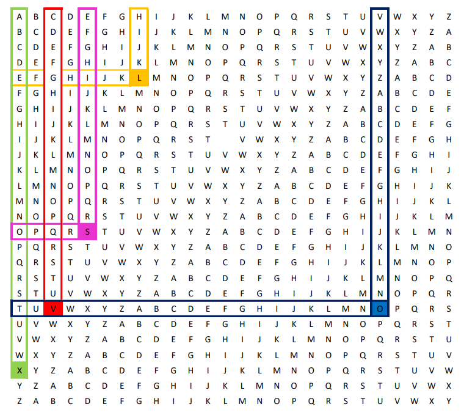

# Criptografia Cifra-Vigenere
## Integrantes: Alison Leal, Breno Nogueira, Davi Sousa Alves, Eduardo Soares
## O que é a criptografia
Na criptografia, encriptação é o processo de codificação de uma mensagem ou informação, de forma que, somente as pessoas autorizadas conseguem ter acesso. O processo de encriptação não isenta de interferências, mas, evita que o conteúdo possa ser visualizado por qualquer um interceptador. Ela é formada por quatro princípios iniciais, sendo eles: Confidencialidade, autenticação, não repudiabilidade e a integridade da informação, (assim, o remetente não consegue negar o envio da informação).

Dentro da criptografia também ocorre a descriptografia, sendo ela o processo contrário da encriptação, onde somente criadores das plataformas e pessoas com um alto conhecimento na área conseguem efetuar, mesmo assim, é exigido grandes recursos computacionais e conhecimento, além do tempo dedicado a essa atividade ser intenso.

É importante ressaltar que nenhuma forma de criptografia é totalmente segura, Nela podemos citar as:

Assimétricas (Públicas): As chaves são públicas e para cada acesso é gerada uma chave. É mais recomendado utilizar em casos onde irá ser utilizada por diversas pessoas e a localidade de cada usuário é distante.

Simétricas (Privadas): As chaves utilizadas serão idênticas, tanto pelo fornecedor quanto pelor receptor, dessa forma, é melhor ser utilizada para casos em que conseguimos enviar a chave pessoalmente, já que, a partir do momento em que enviamos via web, a mesma pode estar sendo exposta.

## Cifra de Vigenère
A cifra de Vigenère é um método de criptografia que usa uma série de diferentes cifras de César baseadas em letras de uma senha. Trata-se de uma versão simplificada de uma mais geral cifra de substituição polialfabética, inventada por Leon Battista Alberti cerca de 1465.

#### Cifra de Cesar
Numa cifra de César, cada letra do alfabeto é deslocada da sua posição um número fixo de lugares; por exemplo, se tiver um deslocamento de 3, "A" torna-se "D", "B" fica "E", etc. A cifra de Vigenère consiste no uso de várias cifras de César em sequência, com diferentes valores de deslocamento ditados por uma "palavra-chave".

#### Como funciona a Cifra de Vigenère
Para cifrar, é usada uma tabela de alfabetos que consiste no alfabeto escrito 26 vezes em diferentes linhas, cada um deslocado ciclicamente do anterior por uma posição. As 26 linhas correspondem às 26 possíveis cifras de César. Uma palavra é escolhida como "palavra-chave", e cada letra desta palavra vai indicar a linha a ser utilizada para cifrar ou decifrar uma letra da mensagem.

Por exemplo, supondo que se quer criptografar o texto:

**TEXTO**

E a chave que você escolheu é o texto:

**CHAVE**

A primeira letra do texto, **T**, é cifrada usando o alfabeto na linha **C**, que é a primeira letra da chave. Basta olhar para a letra na linha **T** e coluna **C** na grelha de Vigenère, e que é um **V**. Para a segunda letra do texto, ver a segunda letra da chave: linha **E** e coluna **H** , que é **L**, continuando sempre até obter:

#### Texto:	TEXTO | Chave:	CHAVE | Texto cifrado: VLXOS

