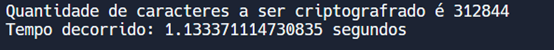

# Projeto - Computabilidade e Complexidade de Algoritmo
## Criptografia Cifra-Vigenere
### Integrantes: Alison Leal, Breno Nogueira, Davi Sousa Alves, Eduardo Soares
### RGM: 30261490, 26565501, 27333582, 28077733
### O que é a criptografia
Na criptografia, encriptação é o processo de codificação de uma mensagem ou informação, de forma que, somente as pessoas autorizadas conseguem ter acesso. O processo de encriptação não isenta de interferências, mas, evita que o conteúdo possa ser visualizado por qualquer um interceptador. Ela é formada por quatro princípios iniciais, sendo eles: Confidencialidade, autenticação, não repudiabilidade e a integridade da informação, (assim, o remetente não consegue negar o envio da informação).

Dentro da criptografia também ocorre a descriptografia, sendo ela o processo contrário da encriptação, onde somente criadores das plataformas e pessoas com um alto conhecimento na área conseguem efetuar, mesmo assim, é exigido grandes recursos computacionais e conhecimento, além do tempo dedicado a essa atividade ser intenso.

É importante ressaltar que nenhuma forma de criptografia é totalmente segura, Nela podemos citar as:

Assimétricas (Públicas): As chaves são públicas e para cada acesso é gerada uma chave. É mais recomendado utilizar em casos onde irá ser utilizada por diversas pessoas e a localidade de cada usuário é distante.

Simétricas (Privadas): As chaves utilizadas serão idênticas, tanto pelo fornecedor quanto pelor receptor, dessa forma, é melhor ser utilizada para casos em que conseguimos enviar a chave pessoalmente, já que, a partir do momento em que enviamos via web, a mesma pode estar sendo exposta.

## Cifra de Vigenère
A cifra de Vigenère é um método de criptografia que usa uma série de diferentes cifras de César baseadas em letras de uma senha. Trata-se de uma versão simplificada de uma mais geral cifra de substituição polialfabética, inventada por Leon Battista Alberti cerca de 1465.

#### Cifra de Cesar
Numa cifra de César, cada letra do alfabeto é deslocada da sua posição um número fixo de lugares; por exemplo, se tiver um deslocamento de 3, "A" torna-se "D", "B" fica "E", etc. A cifra de Vigenère consiste no uso de várias cifras de César em sequência, com diferentes valores de deslocamento ditados por uma "palavra-chave".

#### Como funciona a Cifra de Vigenère
Para cifrar, é usada uma tabela de alfabetos que consiste no alfabeto escrito 26 vezes em diferentes linhas, cada um deslocado ciclicamente do anterior por uma posição. As 26 linhas correspondem às 26 possíveis cifras de César. Uma palavra é escolhida como "palavra-chave", e cada letra desta palavra vai indicar a linha a ser utilizada para cifrar ou decifrar uma letra da mensagem.

Por exemplo, supondo que se quer criptografar o texto:

**TEXTO**

E a chave que você escolheu é o texto:

**CHAVE**

A primeira letra do texto, **T**, é cifrada usando o alfabeto na linha **C**, que é a primeira letra da chave. Basta olhar para a letra na linha **T** e coluna **C** na grelha de Vigenère, e que é um **V**. Para a segunda letra do texto, ver a segunda letra da chave: linha **E** e coluna **H** , que é **L**, continuando sempre até obter:

#### Texto:	TEXTO | Chave:	CHAVE | Texto cifrado: VLXOS

## Cifra em Python
Neste trabalho, são utilizados dois tipos diferentes de códigos: um com 
recursividade e outro utilizando um laço "for" para a resolução da criptografia e 
descriptografia
#### Cifra recursiva
A recursividade é empregada neste código para percorrer cada caractere 
do texto de entrada, aplicando a cifra de Vigenère de maneira iterativa. Isso 
possibilita que o algoritmo processe o texto inteiro, caractere por caractere, 
aplicando a cifra à medida que avança.

A recursividade pode tornar o código mais 
simples e legível, podendo evitar 
loops aninhados e complexos que seriam necessários para rastrear a posição atual no texto e na chave. Isso pode simplificar a implementação.

#### Cifra com Laço “for”
A razão pela qual um laço "for" foi utilizado neste código é porque ele 
permite iterar sobre os caracteres do texto de forma controlada e sistemática, 
processando cada caractere individualmente.

Usando um laço "for", o código pode ser 
aplicado a cada caractere de maneira eficiente e consistente, evitando a 
necessidade de repetir a lógica de cifragem ou decifragem para cada caractere 
separadamente.

## Limite dos Algoritmos
No algoritmo da **cifra de recursão**, é possível inserir um texto a ser codificado com no máximo 1000 caracteres. Em Python, existe um limite para a profundidade máxima de recursão, determinada pela configuração padrão do interpretador. Esse limite atua como uma medida de segurança para evitar que um programa recursivo consuma toda a pilha de chamadas, resultando em um estouro de pilha (stack overflow).

Com base nos testes realizados, evidenciados nas figura abaixo, os **laços "for"** demonstram ser mais eficientes em termos de velocidade, uma vez que não apresentam o overhead associado às chamadas de função recursiva. Adicionalmente, compiladores e interpretadores de linguagens de programação frequentemente otimizam loops, tornando-os mais eficientes. No entanto, a eficiência também depende do contexto de uso; em casos em que a proposta e a resolução são pequenas, **a diferença entre os métodos é quase nula**.

## Complexidade do algoritmo da Cifra de Vigenère
### Notação Big O
A notação **Big O** é uma maneira de medir a complexidade de um algoritmo, descrevendo como o tempo de execução ou o espaço de memória aumenta à medida que o tamanho da entrada cresce. Em outras palavras, ela auxilia na previsão de quanto tempo ou espaço um algoritmo demandará para processar uma quantidade específica de dados. Na figura abaixo, apresentam-se as principais notações **Big O**.

#### Complexidade do algoritmo da Cifra de Recursividade
A complexidade global desse algoritmo recursivo é O(n), onde 'n' representa o tamanho do texto de entrada. Isso ocorre porque a parte principal do processamento, realizada pela função cifra_vigenere, envolve uma chamada recursiva para cada caractere do texto, resultando em uma complexidade linear em relação ao tamanho do texto.

As operações de entrada do usuário, como a obtenção do texto, chave e escolha (cifrar ou decifrar), são operações de tempo constante (O(1)) e não afetam a complexidade geral.

#### Complexidade do algoritmo da Cifra com laço “for”
Na função cifra_vigenere, o loop "for" percorre o texto caractere por caractere, resultando em uma complexidade de tempo de O(n), onde 'n' é o tamanho do texto. Dentro do loop, a maioria das operações (verificação de letra, cálculo de índices, operações de soma, subtração e módulo, etc.) são de tempo constante, uma vez que são realizadas para cada caractere individual. A chamada à função “resultado.append(novo_char)” dentro do loop também é uma operação de tempo constante. No geral, a complexidade da função “cifra_vigenere” é dominada pela complexidade do loop, ou seja, O(n).

## Linguagem interpretada e Linguagem compilada
Uma **linguagem interpretada (Python)** é uma linguagem de programação que passa por um programa chamado interpretador, o qual lê e executa o código fonte linha por linha. Isso proporciona portabilidade e flexibilidade, mas geralmente resulta em um desempenho mais lento.

Já uma **linguagem compilada (C)** é uma linguagem de programação que passa por um programa chamado compilador, responsável por converter diretamente o código fonte em código de máquina, o qual é o código binário que o processador pode executar. Isso oferece desempenho rápido e eficiente, porém com pouca portabilidade.

### Comparativo entre as linguagens
O código em Python é mais flexível em termos de manipulação de strings e índices negativos, facilitando a implementação da cifra de Vigenère.

As operações para calcular índices de caracteres no código Python são mais diretas (ord(char) - 65) em comparação com o código C (c - 'A'), conforme observado na Figura 10, proporcionando uma leitura mais fácil.

A complexidade de ambos os algoritmos é **O(n)**.